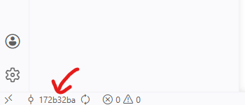
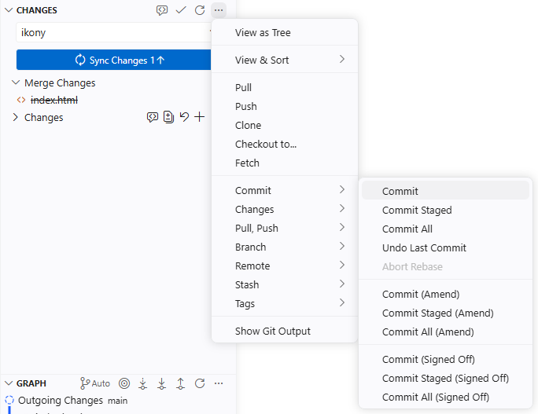

# Zadání úkolů: Git a GitHub ve VS Code

## Úkol 1: Naklonování repozitáře

### Cíl
Naučit se stáhnout existující projekt z GitHubu do počítače.

### Zadání
- Otevři VS Code bez otevřené složky (případně File - New Window).
- Ve VS Code otevři **Source Control**, vyber **Clone Repository**.
- V horní liště vyber Clone from Github, vyber pak svůj projekt, následně vyber složku na počítači, do které se projekt stáhne.
- Ověř, že vidíš všechny soubory a dosavadní historii GITu.

### Co si máš uvědomit
- Klonování vytvoří lokální kopii repozitáře.
- Po klonování můžeš dělat změny a commitovat je lokálně.
- GitHub a lokální projekt se synchronizují přes pull a push.

## Úkol 2: První změna a první commit

### Cíl
Zjistit, že Git sleduje změny v souborech.

### Zadání
- Otevři svůj projekt webové stránky ve VS Code.
- V souboru `index.html` změň hlavní nadpis stránky.
- Přidej pod nadpis jeden nový odstavec.
- Otevři záložku Source Control.
- Prohlédni si, které soubory VS Code označil jako změněné.
- Vytvoř commit s popisem změny.
- Nahraj změnu na GitHub.
- Vyzkoušej že se změna objevila na tvém webu (něco.github.io)

### Co si máš uvědomit
- Git pozná, co se změnilo.
- Commit je uložení verze projektu s popisem.
- Na GitHub se změny dostanou až po odeslání (Push).

## Úkol 3: Smysluplná zpráva ke commitu

### Cíl
Pochopit, že commit message má popisovat změnu.

### Zadání
- Uprav navigaci webu: přidej novou položku menu, nebo přejmenuj stávající položku.
- Napiš commit message tak, aby z ní bylo jasné:
	- co jsi změnil(a),
	- ne proč „něco funguje“, ale jaká změna proběhla.
- Udělej commit.

### Příklad vhodných zpráv
- Přidána položka Kontakt do menu
- Upraven hlavní nadpis na úvodní stránce
- Doplněn odstavec o projektu

### Nevhodné zprávy
- změna
- hotovo
- aaaa
- oprava

## Úkol 4: Vrátím se k předchozí verzi

### Cíl
Uvědomit si, že Git pomáhá při chybě.

### Zadání
- Záměrně udělej na stránce nevhodnou změnu:
	- smaž kus textu,
	- rozbij strukturu stránky,
	- nebo změň styl tak, že stránka vypadá hůř.
- Podívej se ve VS Code, co je změněné.
- Zkus změnu zahodit nebo vrátit zpět ještě před commitem.
- Potom udělej jinou malou správnou změnu a commitni ji.

### Co si máš uvědomit
- Ne každá změna musí skončit v commitu.
- Git pomáhá bezpečně experimentovat.

## Úkol 5: Historie projektu

### Cíl
Naučit se číst historii změn.

### Zadání
- Otevři historii commitů svého projektu na GitHubu.
- Najdi:
	- svůj první commit,
	- poslední commit.

## Úkol 6: Otevření starší verze

### Cíl
Naučit se otevřít dřívější stav projektu.

### Zadání
- Otevři si na počítači `index.html` v prohlížeči.
- V historii commitů vyber jeden starší commit a otevři jeho obsah (klikni pravým tlačítkem, vyber **Checkout**).
- Zaktualizuj okno prohlížeče a zkontroluj, že máš otevřenou starší verzi projektu.
- Přepni se zpět na aktuální větev (např. `main`) - např. vlevo dole:  
 
- Zaktualizuj okno prohlížeče a zkontroluj, že máš otevřenou nejnovější verzi projektu.

### Co si máš uvědomit
- Otevření staršího commitu neznamená trvalou změnu historie.

## Úkol 7: Chybná změna, commit a návrat zpět

### Cíl
Naučit se vrátit konkrétní nevhodný commit pomocí historie.

### Zadání
- Udělej na webu schválně chybnou změnu (např. smaž nadpis) a commitni ji.
- Tento commit je poslední ve větvi a ještě není pushnutý na GitHub.
- Ve VS Code otevři Source Control → … → Commit → **Undo Last Commit**.
 - 
- Tím se zruší poslední commit v historii větve, ale změny z něj zůstanou v pracovním adresáři, takže je můžeš upravit a commitnout znovu, případně změny zahodit.

### Co si máš uvědomit
- Tohle je ideální varianta pro začátečníky, když „jsem commitnul(a) blbost, ale ještě jsem to neposlal(a) na GitHub“.
- I commitnutou chybu lze bezpečně vrátit.

## Úkol 8: README na GitHubu

### Cíl
Uvědomit si, že repozitář není jen kód.

### Zadání
- Otevři soubor `README.md`.
- Doplň do něj:
	- název projektu,
	- stručný popis webu,
	- jméno autora/autorky.
- Commitni změnu a nahraj ji na GitHub.

### Přínos
- GitHub slouží i k popisu projektu.
- Každý repozitář má mít stručné vysvětlení, co obsahuje.

## Úkol 9: Odevzdání URL repozitáře do Teams

### Zadání
- Otevři svůj repozitář na GitHubu v prohlížeči.
- Zkopíruj URL adresu repozitáře.
- Otevři Microsoft Teams a přejdi do úkolu v části Zadání.
- Vlož URL repozitáře do odevzdání a úkol odešli.

## Shrnutí - doporučená pravidla pro studenty
- Commituj až tehdy, když má změna nějaký smysl.
- Popis commitu má být stručný a konkrétní.
- Před commitem se podívej, co přesně odesíláš.
- Git není jen záloha, ale i historie práce.
